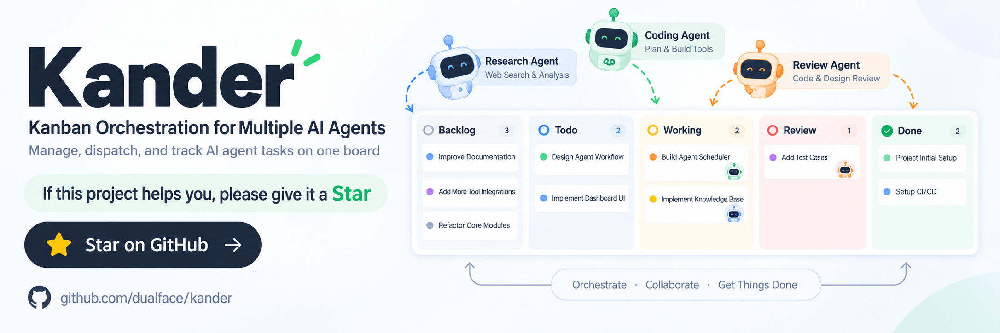
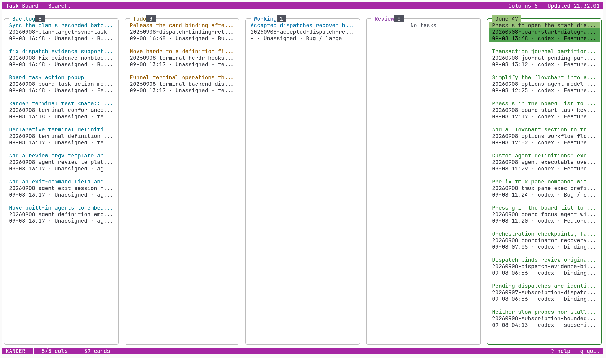

# Kander

[English](README.md) | **简体中文** | [日本語](README-JA.md)

[](https://github.com/dualface/kander)

一个人用看板调度多个 AI Agent.


## 1. 快速开始

运行需要 Git, 以及 Codex, Claude, Grok 或 Cursor 中至少一个.

**macOS** — 使用 Homebrew 安装:

```sh
brew install dualface/tap/kander
kander
```

**Linux** — 直接下载二进制:

```sh
ARCH=$(uname -m); [ "$ARCH" = x86_64 ] && ARCH=amd64; [ "$ARCH" = aarch64 ] && ARCH=arm64
curl -fsSL "https://github.com/dualface/kander/releases/latest/download/kander-linux-${ARCH}.tar.gz" | tar xz
./kander
```

**Windows** — 从 [Releases](https://github.com/dualface/kander/releases) 下载 `kander-windows-amd64.zip`, 解压后运行 `kander.exe`.

首次启动若尚未安装, 会进入交互向导. 安装完成后即可使用.

4 步上手:

1. 新建一个 Agent 会话, 在里面讨论需求或者任务, 说清楚目标和验收条件. 推荐使用 Agent 的 Plan 模式.
2. 任务确认后, Agent 会询问是否用看板流程启动任务. 确认即可自动启动任务.
3. 有多个需求时, 对每个需求重复步骤 1-2, 不断安排并启动任务.
4. 用命令行界面查看任务状态:

```sh
kander
```



> 上图看板内容来自我的真实项目 [https://quicktui.ai](https://quicktui.ai). QuickTUI 是一个远程操作电脑上各种 Agent 的工具, 支持 iOS/Android/macOS/Linux/Windows, 免费使用.

进阶阅读: 幻灯片 [如何高效推进任务](docs/how-to-advance-tasks-efficiently-cn.pdf) (PDF).

## 2. 许可

本项目使用 MIT License, 见 [LICENSE](LICENSE).
